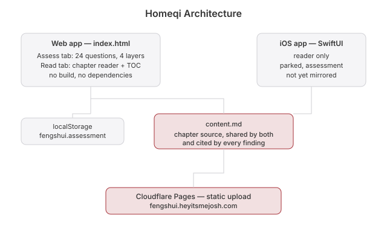

# Feng Shui

 

**Live:** https://fengshui.heyitsmejosh.com

Assess the place you live against the four energy layers of fengshui, then read the reasoning. Condensed from *Good Fengshui* by Eva Wong.

## What it does

The book is Form School, and its chapters are already checklists. The **Assess** tab turns them into 24 questions across the four layers the book works through, outside in:

| Layer | Chapter | What it covers |
|---|---|---|
| Land | 8 | Hills, valleys, waterways, discontinuities, plant and animal life |
| Neighbourhood | 9 | Public space, traffic, upkeep, land-use mix, how it feels to walk |
| Building | 10 | Proportion, materials, floor plan, light and air, connection |
| Objects | 11 | Transmission lines, towers, industrial structures, view, clutter |

Answer yes / no / unsure. Each concerning answer surfaces the book's own reasoning and a link into the chapter it came from. Land and neighbourhood concerns sort first and are marked as siting decisions, because the book is explicit that nothing done indoors remedies them.

Answers save to `localStorage`. No account, no backend, no build step.

## Files

- `index.html` — the whole app: assessment, reader, and the question set
- `content.md` — chapter source, shared by web and iOS
- `tokens.css` — shared design tokens

Self-check: open `index.html?selftest` and read the console.

## iOS App

`ios/FengShui` is a native SwiftUI reader. It is parked and does not yet have the assessment — see `roadmap.md`.

## Roadmap

See `roadmap.md`.

## Whitepaper

[Technical whitepaper](WHITEPAPER.md)

## Architecture

